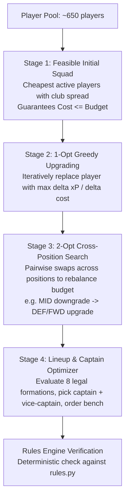

# Mathematical Optimizer & Multi-Gameweek Planning

This document details the mathematical optimization engines introduced in **FPL Manager V0.3**:
1. **Combinatorial Branch-and-Bound Multi-Transfer Solver** (`fpl suggest-transfers`)
2. **Multi-Stage Wildcard & Free-Hit 15-Player Squad Optimizer** (`fpl wildcard` / `fpl free-hit`)
3. **Beam Search Multi-Gameweek Planning Roadmap** (`fpl plan`)

All algorithms are implemented in **pure Python standard library** (without heavy binary dependencies such as SciPy or PuLP), ensuring zero setup friction, fast start-up, and deterministic reproducibility.

---

## 1. Branch-and-Bound Multi-Transfer Solver

### Problem Formulation
Given a current 15-player squad, an available bank balance $B$, and $FT$ available free transfers:
We wish to select a subset of $K$ players to sell, $\mathcal{S}_{\text{out}} \subset \text{Squad}$ ($|\mathcal{S}_{\text{out}}| = K$), and a corresponding subset of $K$ players to purchase, $\mathcal{S}_{\text{in}} \subset \text{Pool}$ ($|\mathcal{S}_{\text{in}}| = K$), such that:

1. **Position Equality**: For each position $P \in \{\text{GKP}, \text{DEF}, \text{MID}, \text{FWD}\}$, the number of players sold in position $P$ equals the number of players bought in position $P$:
   $$|\mathcal{S}_{\text{in}} \cap P| = |\mathcal{S}_{\text{out}} \cap P|$$
2. **Budget Constraint**:
   $$\sum_{p \in \mathcal{S}_{\text{in}}} \text{Price}(p) \le B + \sum_{p \in \mathcal{S}_{\text{out}}} \text{SellingPrice}(p)$$
3. **Club Limit**:
   $$\text{Count}(T, \text{Squad} \setminus \mathcal{S}_{\text{out}} \cup \mathcal{S}_{\text{in}}) \le 3 \quad \forall \text{ teams } T$$
4. **Objective Function**: Maximize score:
   $$\text{Score} = \Delta \text{Metric}(\mathcal{S}_{\text{in}}, \mathcal{S}_{\text{out}}) - 4 \times \max(0, K - FT) + 0.1 \times \Delta \text{FDR}$$

### Pruning and Acceleration Techniques

Naive Cartesian evaluation of $K=4$ transfers would require evaluating up to:
$$\binom{15}{4} \times N_{\text{candidates}}^4 \approx 1,365 \times 30^4 \approx 1.1 \times 10^9 \text{ combinations}$$
which takes minutes. Our recursive branch-and-bound solver evaluates 4 transfers in **~0.3 seconds** using three core techniques:

1. **Canonical Position Ordering & Symmetry Breaking**:
   When purchasing multiple players of the same position (e.g. 2 midfielders), purchasing $(M_1, M_2)$ produces the exact same squad as $(M_2, M_1)$. By grouping required positions canonically and enforcing index ordering ($j > i$ for identical positions), the search space is cut by $K!$ ($2\times$ to $6\times$ reduction).
2. **Upper-Bound Heap Pruning**:
   Candidates in each position are presorted by maximum possible marginal contribution. At any recursion depth $d$, if the current accumulated score plus the maximum possible upper bound of the remaining $K - d$ positions cannot exceed the worst candidate in our top-$N$ min-heap:
   $$\text{CurrentScore} + \sum_{s=d}^{K-1} \text{MaxScore}(P_s) \le \text{HeapWorst}$$
   the entire subtree is pruned immediately without evaluating its children.
3. **Budget Feasibility Bounds**:
   At each level, if remaining budget is less than the minimum price required to fill the remaining positions ($\sum_{s=d}^{K-1} \text{MinPrice}(P_s)$), the branch is pruned.

---

## 2. Wildcard & Free-Hit 15-Player Squad Optimizer

### Problem Formulation
Select an optimal 15-player squad from the entire Premier League active player pool subject to:
- Exactly 2 Goalkeepers
- Exactly 5 Defenders
- Exactly 5 Midfielders
- Exactly 3 Forwards
- Maximum 3 players from any single Premier League club
- Total squad cost $\le$ Budget ($B$)
- Maximizes starting XI score under the best legal outfield formation.

### Three-Stage Optimization Architecture



1. **Stage 1: Feasible Initial Squad**:
   Builds a valid 15-player squad using low-cost active players while actively balancing team quotas. This guarantees feasibility ($\text{Cost} \le B$) within 1 millisecond.
2. **Stage 2: 1-Opt Greedy Upgrading**:
   Repeatedly identifies the single swap $(p_{\text{curr}} \to p_{\text{cand}})$ within the same position that maximizes score improvement while remaining within the available bank balance.
3. **Stage 3: 2-Opt Cross-Position Local Search**:
   Evaluates pairwise swaps $(p_1, p_2) \to (c_1, c_2)$ across different positions. This allows reallocating budget between positions (e.g. downgrading a £10.0m midfielder to £7.5m to upgrade a £4.5m defender to £7.0m) whenever the net gain is positive.
4. **Stage 4: Starting XI and Captaincy Selection**:
   Evaluates all 8 legal outfield formations (`LEGAL_FORMATIONS`: 3-5-2, 3-4-3, 4-4-2, 4-3-3, 4-5-1, 5-3-2, 5-4-1, 5-2-3). Selects the top 11 starters, assigns Captain (2x multiplier) and Vice-Captain, and orders the bench (GK Sub followed by outfield substitutes in descending projected order).

---

## 3. Multi-Gameweek Planning Roadmap (`fpl plan`)

Single-gameweek greedy transfers often lead to poor decisions: burning a transfer on a marginal sideways move when rolling a free transfer unlocks a 2-transfer combination next week, or buying a player for one easy fixture who then faces difficult fixtures or blanks.

`fpl plan` models the decision tree across a rolling horizon $H$ (typically 3 to 6 gameweeks) using **Beam Search**:

### State Dynamics
At each gameweek step $t \in [0, H-1]$:
- **State**: Squad of 15 players, bank balance, available free transfers $FT \in [1, 5]$, and player purchase prices.
- **Actions**:
  - **ROLL**: Make 0 transfers. $FT_{t+1} = \min(5, FT_t + 1)$. Hits = 0.
  - **1_TRANSFER**: Make 1 transfer. If $FT_t \ge 1$, Hits = 0; else Hits = 4. $FT_{t+1} = \min(5, \max(0, FT_t - 1) + 1)$.
  - **2_TRANSFERS**: Make 2 transfers. Hits = $\max(0, 2 - FT_t) \times 4$. $FT_{t+1} = \min(5, \max(0, FT_t - 2) + 1)$.
- **Step Reward**:
  $$\text{Reward}_t = \text{StartingXI\_xP}(squad_t, GW_t) + \text{Captain\_xP}(squad_t, GW_t) - \text{Hits}_t$$
- **Cumulative Objective**:
  $$\max \sum_{t=0}^{H-1} \text{Reward}_t$$

### Zero-Hit Mode & Risk Profiles
- `--no-hits`: Disallows point hits entirely, exploring only plans that use rolled free transfers and available FTs.
- `--risk [neutral|floor|ceiling]`:
  - `neutral`: Maximizes mean expected points.
  - `floor`: Maximizes 10th-percentile projected floor, favoring rotation-proof, penalty-taking, high-floor players.
  - `ceiling`: Maximizes 90th-percentile projected ceiling, favoring explosive, high-ceiling attacking differentials.

### Example CLI Output
```text
$ fpl plan --horizon 3
Multi-Gameweek Transfer Roadmap (GW3 - GW5) | Bank: £0.0m | FT: 1
Optimal Plan (#1): 168.9 Net xP [Floor: 48.1, Ceil: 341.9] | Total Hits: -4pt

Gameweek Schedule:
  GW3: 2 TRANSFERS (-4pt hit)
       Move: Tielemans -> De Cuyper, Palestra -> Mundle
       Lineup: 56.9 xP [Floor: 15.8, Ceil: 109.9] | Net: 52.9 xP | Form: 3-4-3 | Cap: Mundle (9.4 xP)
       Bank Remaining: £1.6m | Free Transfers Banked for next GW: 1

  GW4: 1 TRANSFER (Free)
       Move: Rice -> Mbeumo
       Lineup: 58.8 xP [Floor: 16.1, Ceil: 118.1] | Net: 58.8 xP | Form: 3-4-3 | Cap: Mundle (9.5 xP)
       Bank Remaining: £1.1m | Free Transfers Banked for next GW: 1

  GW5: 1 TRANSFER (Free)
       Move: Rúben -> Guéhi
       Lineup: 57.2 xP [Floor: 16.1, Ceil: 113.9] | Net: 57.2 xP | Form: 3-4-3 | Cap: Mundle (7.8 xP)
       Bank Remaining: £0.6m | Free Transfers Banked for next GW: 1

Alternative Strategic Trajectories:
  Plan #2: 168.8 Net xP (Hits: -4pt) | GW3: 2 FT (-4pt) -> GW4: 1 FT -> GW5: 1 FT
  Plan #3: 168.7 Net xP (Hits: -4pt) | GW3: 2 FT (-4pt) -> GW4: 1 FT -> GW5: 1 FT
  Plan #4: 168.3 Net xP (Hits: -0pt) | GW3: 1 FT -> GW4: 1 FT -> GW5: 1 FT
```
