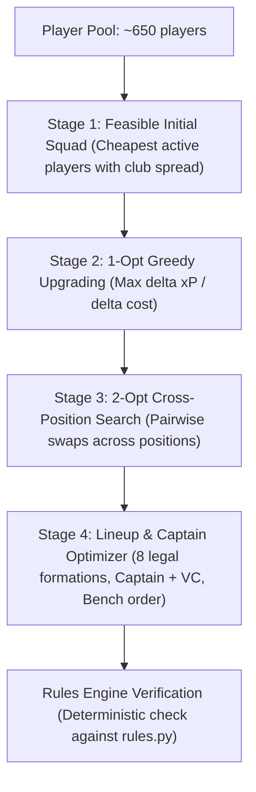

# Mathematical Optimizer & Multi-Gameweek Planning

> **Status:** Canonical Production Release in V1.0.1 (`v1.0.1`). Updated on 2026-09-22.
> **Source Modules:** [`src/fpl_manager/optimizer.py`](../src/fpl_manager/optimizer.py), [`src/fpl_manager/planner.py`](../src/fpl_manager/planner.py), [`src/fpl_manager/lineup.py`](../src/fpl_manager/lineup.py)

This document details the mathematical optimization engines in **FPL Manager V1.0**:
1. **Exact Combinatorial Branch-and-Bound Multi-Transfer Solver (1–5 Transfers)** (`fpl suggest-transfers`)
2. **Heuristic Local-Search Wildcard & Free-Hit 15-Player Squad Optimizer** (`fpl wildcard` / `fpl free-hit`)
3. **Beam Search & Exhaustive Reference Multi-Gameweek Planning Roadmap** (`fpl plan`)

All algorithms are implemented in **pure Python standard library** (without heavy binary dependencies such as SciPy or PuLP), ensuring zero setup friction, fast start-up, and deterministic reproducibility.

---

## 1. Branch-and-Bound Multi-Transfer Solver (`1–5` Transfers)

### Problem Formulation
Given a current 15-player squad, an available bank balance $B$, and $FT$ available free transfers:
We wish to select a subset of $K \in \{1, 2, 3, 4, 5\}$ players to sell, $\mathcal{S}_{\text{out}} \subset \text{Squad}$ ($|\mathcal{S}_{\text{out}}| = K$), and a corresponding subset of $K$ players to purchase, $\mathcal{S}_{\text{in}} \subset \text{Pool}$ ($|\mathcal{S}_{\text{in}}| = K$), such that:

1. **Position Equality**: For each position $P \in \{\text{GKP}, \text{DEF}, \text{MID}, \text{FWD}\}$, the number of players sold in position $P$ equals the number of players bought in position $P$:
   $$|\mathcal{S}_{\text{in}} \cap P| = |\mathcal{S}_{\text{out}} \cap P|$$
2. **Budget Constraint**:
   $$\sum_{p \in \mathcal{S}_{\text{in}}} \text{Price}(p) \le B + \sum_{p \in \mathcal{S}_{\text{out}}} \text{SellingPrice}(p)$$
3. **Club Limit**:
   $$\text{Count}(T, \text{Squad} \setminus \mathcal{S}_{\text{out}} \cup \mathcal{S}_{\text{in}}) \le 3 \quad \forall \text{ teams } T$$
4. **Objective Function**: Maximize score:
   $$\text{Score} = \Delta \text{Metric}(\mathcal{S}_{\text{in}}, \mathcal{S}_{\text{out}}) - 4 \times \max(0, K - FT) + 0.1 \times \Delta \text{FDR}$$

### Independent Exact Reference Oracle (`solve_transfers` vs `solve_transfers_exact_reference`)
In V1.0, `solve_transfers` is verified against an **independent brute-force Cartesian reference oracle** (`solve_transfers_exact_reference` / `solve_transfers_bruteforce_reference` in [`src/fpl_manager/optimizer.py`](../src/fpl_manager/optimizer.py), bounded by `MAX_REFERENCE_EVALUATIONS = 100_000`) across $K \in \{1, 2, 3, 4, 5\}$ transfers:
- **Zero Shared Search Logic**: `solve_transfers_exact_reference` enumerates $\binom{|\text{OUT}|}{K} \times \binom{|\text{IN}|}{K}$ directly via `itertools.combinations`, checks full squad legality (`validate_squad`), club limits ($\le 3$), player availability (`status == "a"`), and budget independently, and raises `ValueError` if combinations exceed `MAX_REFERENCE_EVALUATIONS`.
- **Admissible Branch-and-Bound Pruning (`P1.5`)**: Because candidate pools within each position are sorted monotonically by exact additive contribution $\text{eff}(p) = \text{Metric}(p, \text{risk\_profile}) - \frac{0.1 \times \text{FDR}(p)}{K}$ and upper-bound pruning only discards subtrees whose theoretical maximum cannot beat the current top-$N$ heap minimum, `solve_transfers` is provably admissible and never prunes FDR-inverted optima.

---

## 2. Heuristic Local-Search Wildcard & Free-Hit Optimizer (`solve_wildcard`)

> [!IMPORTANT]
> **Methodological Disclosure (V1.0):** Unlike the 1–5 transfer solver (`solve_transfers`), which is verified against `solve_transfers_exact_reference`, the 15-player full-squad solver (`solve_wildcard`) is a **multi-stage heuristic local-search optimizer** (`algorithm = "heuristic_local_search_1opt_2opt"`, `is_exact_global_optimum = False`, `optimality_guarantee = "heuristic_local_optimum"`). Every `solve_wildcard` report explicitly embeds these fields in `optimization_metadata`.

### Problem Formulation
Select a legal 15-player squad from the active Premier League pool subject to:
- Exactly 2 Goalkeepers, 5 Defenders, 5 Midfielders, 3 Forwards
- Maximum 3 players from any single Premier League club
- Total squad cost $\le$ Budget ($B$)
- Maximizes starting XI score under the best legal outfield formation.

### Four-Stage Heuristic Local-Search Architecture

---

## 3. V1.0 Risk Profiles, Neutral Default (`w = 0.0`), & Lineup Quantity Separation

All optimizers (`lineup.py`, `optimizer.py`, `planner.py`, and `DecisionEngineV10`) share the canonical `RISK_PROFILE_SPECIFICATIONS` defined in [`src/fpl_manager/optimizer.py`](../src/fpl_manager/optimizer.py):

| Risk Profile | Mathematical Objective | `lineup_penalty_weight` | Purpose |
| :--- | :--- | :---: | :--- |
| **`neutral`** *(V1.0 Default)* | $\max \mathbb{E}[xP]$ | `0.00` | Pure expected-points maximization with zero variance penalty (custom `lineup_penalty_weight` remains supported for experimentation) |
| **`safe`** | $\max (\mathbb{E}[xP] - 0.15 \times \sigma)$ | `0.15` | Mild downside variance penalty (preserves V0.9 default behavior) |
| **`conservative`** / `floor` | $\max xP_{\text{floor}}$ (10th percentile) | `0.35` | Maximizes guaranteed appearance and floor points |
| **`upside`** / `ceiling` | $\max xP_{\text{ceiling}}$ (90th percentile) | `-0.15` | Maximizes haul potential and ceiling upside |
| **`differential`** | $\max (\mathbb{E}[xP] + 0.25 \times (xP_{\text{ceiling}} - \mathbb{E}[xP]))$ | `-0.10` | Rewards high-upside variance for rank-chasing |

In [`src/fpl_manager/lineup.py`](../src/fpl_manager/lineup.py), `select_starting_lineup` strictly separates:
- **Model Quantities (`model_quantities`)**: `starters_xp`, `captain_bonus`, and `total_lineup_xp` (always computed from pure `expected_points`, unaffected by `risk_profile` or `lineup_penalty_weight`).
- **Decision Quantities (`decision_quantities`)**: `starters_obj`, `captain_obj`, and `total_lineup_obj` (the risk-adjusted optimization objective used to rank formations and captains).

---

## 4. Multi-Gameweek Planning Roadmap (`fpl plan`)

`fpl plan` models the sequential decision tree across a rolling horizon $H$ using **Beam Search** (`generate_multi_gameweek_plan`, which reports `optimization_metadata.is_exact_global_optimum = False` and `algorithm = "beam_search_multi_gw"`), and provides an **independent Dynamic Programming reference oracle** (`plan_multi_gw_exact_reference` / `plan_multi_gw_dp_reference`, bounded by `MAX_MULTI_GW_REFERENCE_STATES = 25_000`) that solves the Bellman optimality equation:
$$V(\text{state}, GW) = \max_{a \in \mathcal{A}(\text{state})} \Big( \text{ImmediateReward}(\text{state}, a, GW) + V(\text{next\_state}, GW + 1) \Big)$$
independently of the forward beam-search loop.

### State Dynamics
At each gameweek step $t \in [0, H-1]$:
- **State**: Squad of 15 players, bank balance, available free transfers $FT \in [1, 5]$, and player purchase prices.
- **Actions**:
  - **ROLL**: Make 0 transfers. $FT_{t+1} = \min(5, FT_t + 1)$. Hits = 0.
  - **1_TRANSFER**: Make 1 transfer. Hits = $\max(0, 1 - FT_t) \times 4$.
  - **2_TRANSFERS**: Make 2 transfers. Hits = $\max(0, 2 - FT_t) \times 4$.
- **Step Reward**:
  $$\text{Reward}_t = \text{StartingXI\_xP}(squad_t, GW_t) + \text{Captain\_xP}(squad_t, GW_t) - \text{Hits}_t$$
- **Cumulative Objective**:
  $$\max \sum_{t=0}^{H-1} \text{Reward}_t$$

